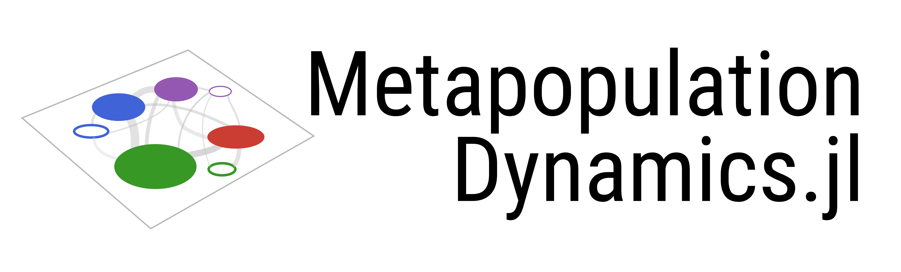

[](https://ecojulia.github.io/MetapopulationDynamics.jl/dev)

MetapopulationDynamics is a package for generalizable simulation of
population dynamics across space, including models of occurrence,
occupancy, and abundance, dispersal, response to environmental
conditions, and more. In addition, these models can be run on
different geometries (rasters, patches, and spatial graphs).

The package includes many 'classic' models from population,
metapopulation, and spatial ecology, but enables extension by allowing
users to define custom models.

Finally, MetapopulationDynamics is integrated with many other EcoJulia
tools, which together form a toolbox for high-performance simulation
of ecological dynamics. [Here's the link to the documentation](TODO).

# Features

## Different Spatial Geometries

MetapopulationDynamics allows different geometry types: a
`SpatialGraph` to represent a discrete set of coordinates in space, or
a `Raster` to represent habitat that exists on continuous grid.


Patches have local dynamics internally within the patch,
and individual move between `Patch`s with a rule.

A `SpatialGraph` is a type of `AbstractSpace` that consists of
set of points.

Rasters

Environmental Layers

## Many mechanisms

MetapopulationDynamics enables simulation of many different types of
mechanisms that influence populations dynamics, including (but not
limited to): deterministic and stochastic local population dynamics,
dispersal, extinction, and change in the previous mechanisms in
response to environmental conditions.

### Combining mechanisms


### Local population dynamics

#### Logistic and Stochastic-Logistic Models

####

### Dispersal

## Built in Classic Models

### Levins metapopulation

### Hanski Incidence-Function Model

### Stochastic-Logistic

### Ricker Models

## Extendable custom models

## Integrations

MetapopulatationDynamics includes several integrations with other packages,
which are loaded using 'lazy-loading' (via the Requires.jl package). This
means the interface between MPD and other packages isn't loaded until
both MPD and the other package are loaded. This is done to reduce the number
of direct dependencies MPD has.


# Examples

## Running a Stochastic-Logistic Model on a spatial Graph with diffusion dispersal

```
using MetapopulationDynamics
using NeutralLandscapes

sg = SpatialGraph()
sl = StochasticLogistic(σ=5.)

@time timeseries = simulate(sl, sg)
```
